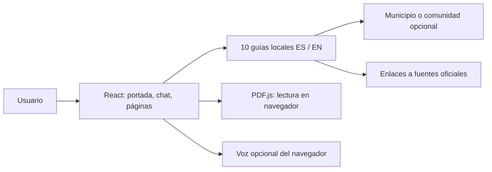
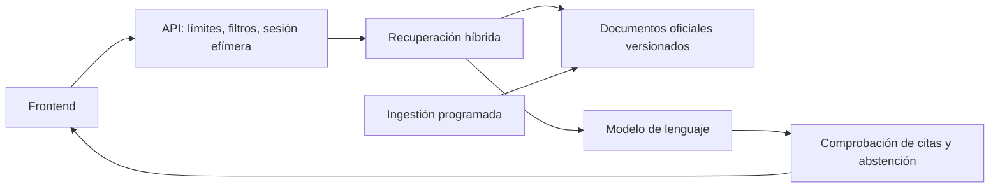

# España: investigación y arquitectura

Investigación inicial: 30 de septiembre de 2026. Implementación actualizada: 2 de octubre de 2026. Referencia: [America.gov](https://america.gov/).

## Lo que hay en la referencia

America.gov es actualmente un portal de consultas conversacionales sobre servicios públicos. La portada conduce a un chat y explica fuentes, privacidad y futuras integraciones. La reconstrucción se basa en inspección del sitio cargado, capturas de escritorio y móvil, navegación y activos que el navegador recibió.

| Superficie | Observación |
| --- | --- |
| Portada | Aviso institucional, cabecera, saludo serif, foto con formulario, carrusel, manifiesto, cuatro bloques de beneficios, avances y pie |
| Chat | Consulta, respuesta por pasos, fuentes, acciones de copiar y valorar, sugerencias y formulario fijo |
| Información | Cómo funciona, privacidad, sobre el proyecto, avances, FAQ y condiciones |
| Móvil | Cabecera compacta, título de 48 px, foto vertical, formulario de dos filas, bloques apilados |

Su [página de funcionamiento](https://america.gov/how-it-works) describe respuestas basadas en sitios oficiales. Su [página de privacidad](https://america.gov/privacy) explica el tratamiento de conversaciones y datos. Son afirmaciones del producto; no demuestran qué proveedor o infraestructura usa.

## Arquitectura observada, con límites

El HTML contiene `astro-island`, rutas de recursos `/_astro/`, un componente React hidratado para la portada y un renderer de React. La evidencia permite identificar **Astro + React**. Las hojas de estilo recibidas contienen la cabecera de Tailwind CSS. Los identificadores de ciertos controles comienzan con `base-ui-`, compatible con el uso de Base UI, aunque no constituye una auditoría completa de dependencias.

Las fuentes servidas son Rhymes Text, Rhymes Display y Helvetica Now. La paleta visible usa azul marino `#002664`, tinta `#000c1f`, enlace `#0066c5` y superficies `#f7f7f7`. En escritorio: saludo de 96 px, imagen de unos 688 × 452 px, radios de 48 px y bloques de características de 432 px. En móvil: saludo de 48 px, foto vertical, radios de 40 px y contenido apilado.

**No se ha identificado** el proveedor de IA, el modelo, el índice de búsqueda, el backend, la base de datos ni el alojamiento. El frontend público no permite deducirlos con rigor. No se ha enviado documentación personal ni probado ninguna gestión administrativa.

## Adaptación a España

Se conserva la estructura, contraste tipográfico, jerarquía, navegación y comportamiento responsive. Se sustituyen la identidad, la consulta inicial, el contexto fotográfico y los organismos. El sitio se presenta como un **prototipo independiente**, sin afiliación al Gobierno de España. No utiliza un dominio gubernamental ni promete funciones administrativas inexistentes.

La referencia anuncia muchas fuentes y futuras gestiones. Esta versión no copia esas cifras ni promete fechas. El chat dice expresamente que usa guías locales y que no hay IA conectada.

## Fuentes españolas consultadas

| Tema | Fuente oficial y uso |
| --- | --- |
| Localizar servicios | [Punto de Acceso General](https://administracion.gob.es/tramites-electronicos): directorio de trámites y administraciones |
| Identificación | [Cl@ve](https://clave.gob.es/registro/como-puedo-registrarme.html): métodos de registro y niveles de identificación |
| Expedientes | [Mi Carpeta Ciudadana](https://carpetaciudadana.gob.es/): información y servicios de organismos participantes |
| Vida laboral | [Import@ss](https://portal.seg-social.gob.es/): informes y formas de acceso a la Seguridad Social |
| Desempleo | [SEPE](https://www.sepe.es/HomeSepe/prestaciones-desempleo.html) y [su sede](https://sede.sepe.gob.es/portalSede/procedimientos-y-servicios/personas.html): orientación y canales de solicitud |
| Documentación | [Interior](https://www.interior.gob.es/opencms/es/servicios-al-ciudadano/tramites-y-gestiones/dni/cita-previa/) y [Cita Previa DNI](https://www.citapreviadnie.es/): citas y requisitos de renovación |
| Renta | [Agencia Tributaria](https://sede.agenciatributaria.gob.es/): acceso a Renta WEB y ayuda oficial |

Las guías orientan hacia estos servicios. No calculan prestaciones ni impuestos, no determinan elegibilidad y no ofrecen fechas, tasas o requisitos personalizados sin comprobar la convocatoria correspondiente. Para ayudas regionales se remite al organismo competente.

## Lo construido

**React 19 + Vite 6**, con rutas del navegador, CSS específico, fotografías españolas, fuentes Inter/Libre Caslon Display bajo SIL OFL e iconos Phosphor bajo MIT. Los activos de referencia sin licencia documentada se conservan fuera del directorio publicado. Se eligió Vite para entregar un frontend comprobable sin añadir un servidor innecesario. No se afirma que esta sea la arquitectura privada de America.gov.

La clasificación compara preguntas completas y patrones de intención en español e inglés, con abstención ante ambigüedad o varios trámites. No es IA, no recupera contenido en tiempo real y puede equivocarse al interpretar una frase. Cuando no hay coincidencia, ofrece el directorio oficial. Los datos del chat permanecen en memoria y desaparecen al recargar.

Padrón y tarjeta sanitaria ofrecen selección territorial opcional dentro de la respuesta. El selector sanitario cubre 17 comunidades y Ceuta/Melilla; el catálogo municipal inicial contiene siete destinos revisados y remite el resto al directorio oficial. Los seguimientos conservan el territorio de la respuesta que los abrió. Los municipios no reconocidos se introducen solo en el campo explícito. No se infieren requisitos personales. Fuentes y límites: [guías](fuentes-guias-practicas-2026-10-02.md), [territorios](fuentes-territoriales-2026-10-02.md).

El lector usa PDF.js bajo demanda, procesa hasta 10 MB y 20 páginas, y muestra hasta 30.000 caracteres extraídos. No sube archivos, no incluye OCR, no verifica autenticidad y no resume con IA. El dictado depende del navegador y de su proveedor de reconocimiento de voz. Las valoraciones y el formulario de opinión son locales.

## Arquitectura propuesta para un asistente real

Mantener el frontend y añadir una API con respuestas en streaming. Una opción concreta sería Node o FastAPI para la API, PostgreSQL con búsqueda textual y pgvector, almacenamiento de documentos y un trabajo programado de ingestión. La selección de modelo y proveedor queda abierta hasta fijar calidad, residencia de datos, coste y condiciones contractuales.

Cada documento debe conservar URL canónica, organismo, jurisdicción, idioma, fecha de captura, fecha de vigencia y hash del contenido. Las respuestas deben citar fragmentos realmente recuperados. Las fuentes permitidas necesitan revisión explícita: existen servicios legítimos en dominios como `seg-social.gob.es`, `sepe.es` y `citapreviadnie.es`, además de `gob.es`.

Para normativa y ayudas, filtrar por territorio y vigencia. Ante falta de evidencia, pedir el dato de contexto imprescindible o remitir al organismo; no inventar requisitos. Tratar documentos y páginas como contenido no confiable para evitar instrucciones maliciosas. Evaluar citas, actualización, abstención y errores en español y en inglés antes de ampliar cobertura.

Las integraciones con Cl@ve o Carpeta Ciudadana necesitan acceso y autorización oficiales. Nunca se deben simular reservas o solicitudes ni recoger credenciales oficiales desde el chat. No hay ninguna integración activa en la entrega.

## Siguiente fase concreta

La identidad española, activos con licencias y publicación del frontend ya están resueltos. La siguiente fase sigue pendiente:

1. Seleccionar proveedor y reglas de datos; configurar secretos exclusivamente en servidor.
2. Implementar ingestión y búsqueda sobre un conjunto pequeño de fuentes oficiales.
3. Conectar la API al chat y reemplazar el aviso de guías locales solo cuando exista una IA real.
4. Validar respuestas y accesibilidad; desplegar después de revisar la versión concreta.

El código, las instrucciones de ejecución y los créditos están en la raíz del repositorio. La comparación visual y las comprobaciones se documentan en [design-qa.md](../design-qa.md).
